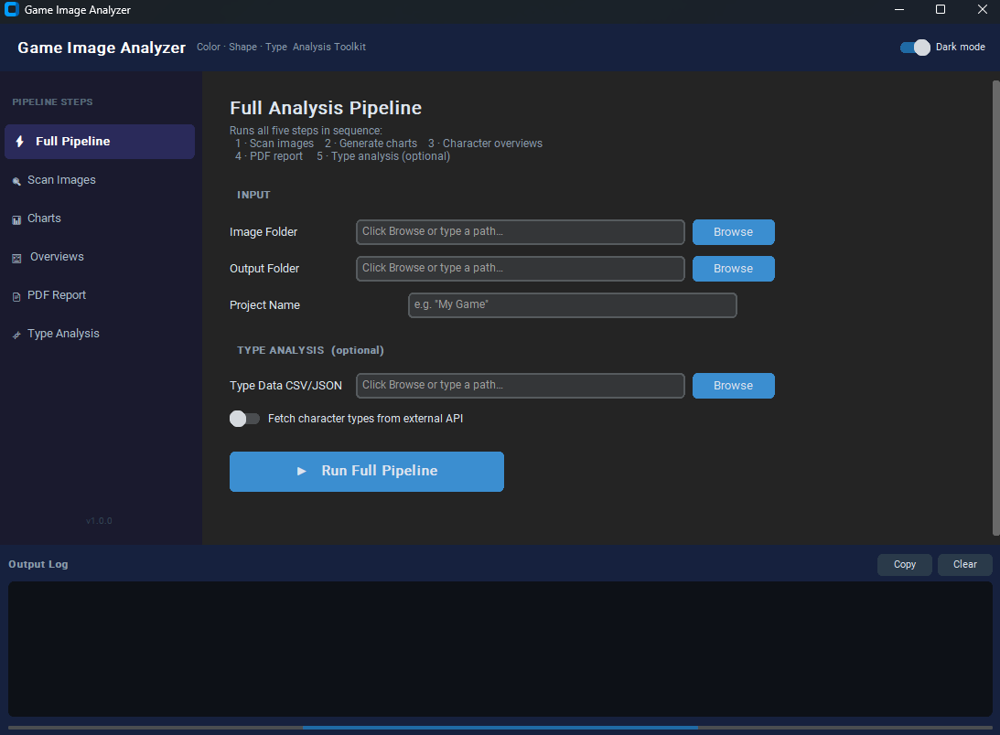
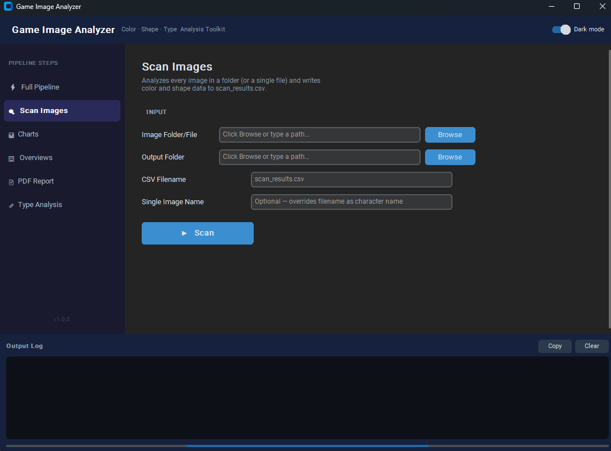
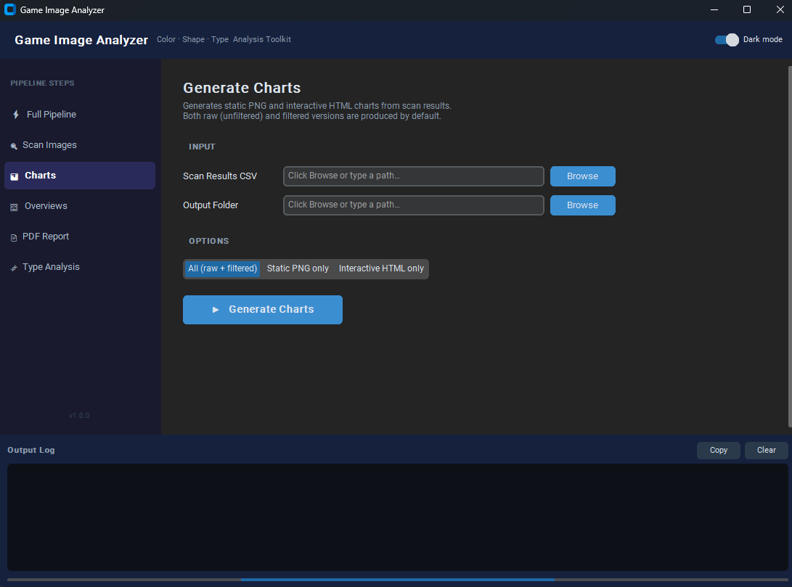
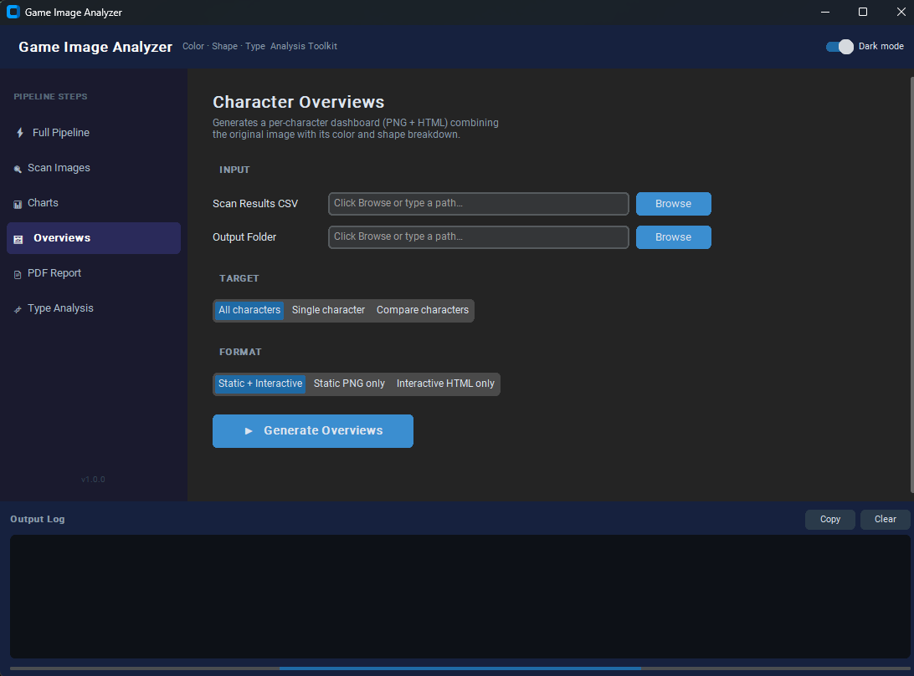
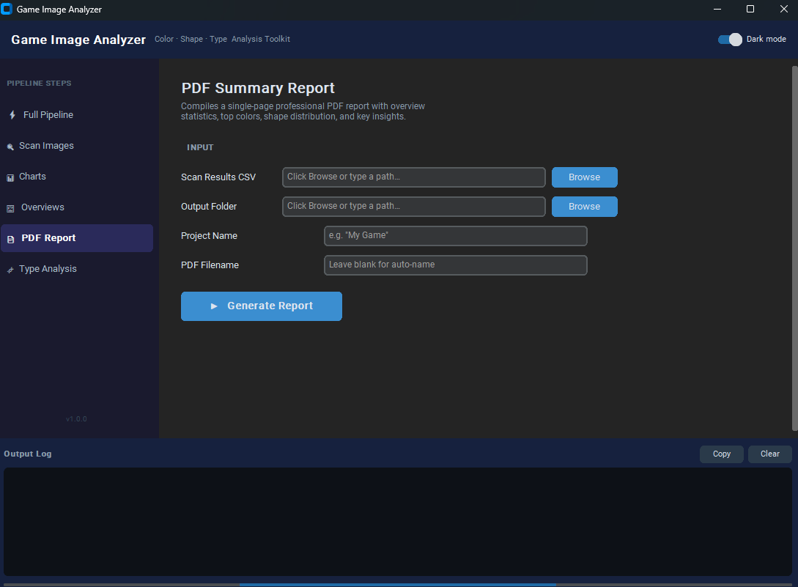
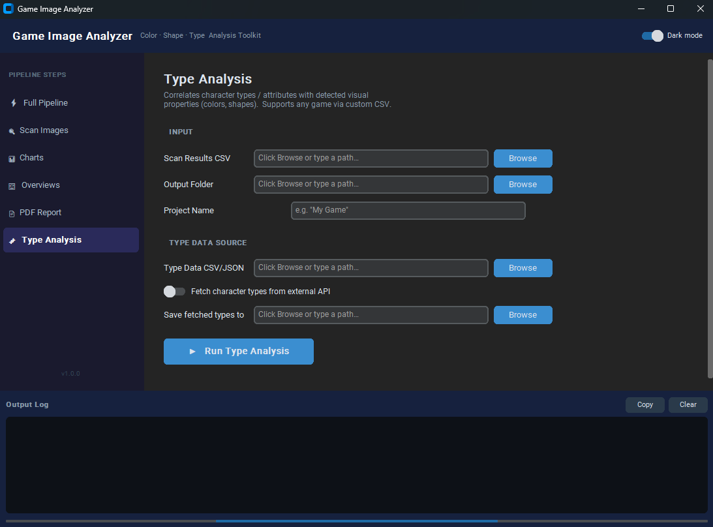

# Game Image Analyzer

A modular Python toolkit for extracting and visualizing **color palettes**, **shape distributions**, and **type–visual correlations** from game character image collections.

Works with any game, franchise, or custom image collection.

---

## Features

- **Automated background removal** — detects and masks solid-color backgrounds, alpha-transparent areas, and complex scenes using a three-stage fallback pipeline (alpha channel → solid-color border detection → Canny edge + morphology).
- **Named-color extraction** — maps every image to a curated palette of 64 descriptive color names (crimson, cobalt, emerald, bubblegum, etc.) via KMeans clustering and nearest-neighbor matching.
- **Shape detection & classification** — identifies circles, ellipses, triangles, squares, rectangles, pentagons, hexagons, stars, blobs, and more using contour analysis, circularity, solidity, and vertex counting.
- **Color–shape correlation** — determines which colors appear inside each detected shape region, producing a per-image color-per-shape breakdown.
- **Raw vs. filtered charts** — generates both unfiltered output and a noise-reduced filtered version that removes outline/shadow colors (black, onyx, charcoal, slate) below a configurable threshold.
- **Static charts (PNG)** — color frequency bars, shape frequency bars, color–shape heatmaps, color-category pie charts, color pair and triplet charts via Matplotlib.
- **Interactive charts (HTML)** — all of the above plus sunburst charts, treemaps, and color-pair network graphs via Plotly.
- **Per-character overviews** — four-panel static PNG and interactive HTML dashboards combining the original image with color and shape breakdowns.
- **Multi-character comparison** — side-by-side static comparison panels for any selection of characters.
- **PDF summary report** — a single-page professional PDF with overview statistics, top colors, shape distribution, color categories, common color pairs, and auto-generated key insights.
- **Type / attribute analysis** — correlates character types (e.g. fire, water, hero, villain) with their detected visual properties; supports custom CSV/JSON type files for any game or an optional external character API.
- **Full pipeline command** — one command runs scan → charts → overviews → PDF report → type analysis end-to-end.
- **Utility: numeric prefix remover** — `tools/delete_file_extensions.py` batch-renames image files by stripping leading numeric prefixes (e.g. `001_warrior.png` → `warrior.png`).

---

## Screenshots

| Full Pipeline | Scan Images |
|---|---|
|  |  |

| Charts | Character Overviews |
|---|---|
|  |  |

| PDF Report | Type Analysis |
|---|---|
|  |  |

---

## Project Structure

This project follows a strict **one class per file** modular architecture. All analysis classes live in the `SBS/` (Step-By-Step) package. The root `main.py` is the sole entry point and contains only CLI wiring.

```
game-image-analyzer/
│
├── main.py                        # CLI entry point — all subcommands
│
├── SBS/                           # Core analysis package (one class per file)
│   ├── __init__.py                # Package init — re-exports all classes
│   ├── config.py                  # Color palettes, shape definitions, settings
│   ├── ImageScanner.py            # ImageScanner       — scans images → CSV
│   ├── ChartGenerator.py          # ChartGenerator     — CSV → PNG + HTML charts
│   ├── OverviewGenerator.py       # OverviewGenerator  — per-character dashboards
│   ├── PDFReportGenerator.py      # PDFReportGenerator — PDF summary report
│   └── TypeAnalyzer.py            # TypeAnalyzer       — type–visual correlations
│
├── tools/
│   └── delete_file_extensions.py  # Utility: strip numeric prefixes from filenames
│
└── requirements.txt
```

---

## Setup

### 1. Clone the repository

```bash
git clone https://github.com/your-username/game-image-analyzer.git
cd game-image-analyzer
```

### 2. Create a virtual environment (recommended)

```bash
python -m venv venv

# Windows
venv\Scripts\activate

# macOS / Linux
source venv/bin/activate
```

### 3. Install dependencies

```bash
pip install -r requirements.txt
```

---

## Usage

All commands follow the pattern `python main.py <command> [options]`.
Run `python main.py --help` or `python main.py <command> --help` for the full option list.

---

### Scan images

Scan a directory of images and export results to CSV:

```bash
python main.py scan ./my_images -o ./output
```

Scan a single image with a custom name:

```bash
python main.py scan ./images/warrior.png -n "Warrior" -o ./output
```

---

### Generate charts

Generate all static (PNG) and interactive (HTML) charts from scan results:

```bash
python main.py charts ./output/scan_results.csv -o ./output/charts
```

Static charts only:

```bash
python main.py charts ./output/scan_results.csv --static-only
```

---

### Generate per-character overviews

All characters:

```bash
python main.py overview ./output/scan_results.csv --all -o ./output/overviews
```

Single character by name:

```bash
python main.py overview ./output/scan_results.csv -n "Warrior"
```

Side-by-side comparison:

```bash
python main.py overview ./output/scan_results.csv --compare Warrior Mage Rogue
```

---

### Generate PDF report

```bash
python main.py report ./output/scan_results.csv -n "My Game" -o ./output
```

---

### Type analysis

With a custom type CSV (any game):

```bash
python main.py types ./output/scan_results.csv -t my_types.csv -n "My Game"
```

With an external character API:

```bash
python main.py types ./output/scan_results.csv --fetch-api
```

**Custom type CSV format:**

```csv
name,type_primary,type_secondary
Warrior,hero,fire
Mage,hero,ice
Villain,enemy,dark
```

---

### Full pipeline (recommended)

Runs all five steps in sequence with a single command:

```bash
# Any game
python main.py full ./my_images -n "My Game" -o ./output

# With external API type data
python main.py full ./game_images --fetch-api -o ./output
```

**Output directory structure after a full run:**

```
output/
├── scan_results.csv
├── my_game_analysis_report.pdf
├── charts/
│   ├── color_frequency_raw.png         color_frequency_filtered.png
│   ├── color_frequency_raw.html        color_frequency_filtered.html
│   └── ... (all chart variants, raw and filtered)
├── overviews/
│   ├── CharacterName_overview.png
│   └── CharacterName_overview.html
└── analysis/                           ← only when type data is provided
    ├── type_color_heatmap.png
    ├── type_shape_heatmap.png
    ├── attribute_correlations.png
    ├── type_analysis_dashboard.html
    └── type_analysis_report.txt
```

---

### Utility — strip numeric prefixes from filenames

Before scanning, if your image files have numeric prefixes (e.g. from a numbered sprite sheet export), use the included utility to batch-rename them:

```bash
# Edit character_dir inside the script to point at your image folder, then run:
python tools/delete_file_extensions.py
```

```
001_warrior.png  →  warrior.png
025_mage.png     →  mage.png
```

---

## Color Palette Reference

The analyzer maps all detected colors to a curated palette of 64 named entries:

| Family | Colors |
|---|---|
| Reds | crimson, scarlet, cherry, ruby, burgundy, maroon, coral, salmon |
| Oranges | tangerine, pumpkin, amber, rust, peach, apricot |
| Yellows | gold, canary, lemon, mustard, cream, buttercup |
| Greens | emerald, jade, mint, sage, olive, forest, lime, teal, seafoam |
| Blues | sky, azure, cobalt, navy, sapphire, cerulean, powder, steel, denim, cyan |
| Purples | lavender, lilac, violet, plum, grape, orchid, mauve, amethyst, indigo |
| Pinks | rose, blush, fuchsia, magenta, bubblegum, flamingo, hot_pink |
| Browns | chocolate, coffee, caramel, tan, sienna, mahogany, bronze |
| Neutrals | white, ivory, pearl, silver, ash, slate, charcoal, onyx, black |

Colors are also grouped into six thematic categories — **warm**, **cool**, **neutral**, **vibrant**, **pastel**, and **dark** — used for category-level charts and the PDF report.

---

## Shape Detection Reference

| Category | Shapes |
|---|---|
| Geometric | circle, ellipse, triangle, square, rectangle, pentagon, hexagon |
| Organic / Complex | star, curved, angular, spiky, blob, spiral |

---

## Dependencies

| Library | Purpose |
|---|---|
| `opencv-python` | Image loading, edge detection, contour analysis |
| `numpy` | Array operations, distance calculations |
| `scikit-learn` | KMeans clustering for dominant color extraction |
| `scipy` | Morphological image operations |
| `Pillow` | Supplementary image handling |
| `pandas` | CSV data management |
| `matplotlib` | Static chart generation (PNG) |
| `plotly` | Interactive chart generation (HTML) |
| `reportlab` | PDF report generation |
| `requests` | External API HTTP requests |

---

## Tips for Best Results

- **Transparent PNG images** work best — the scanner uses the alpha channel directly as a foreground mask.
- **Consistent filenames** — make sure image filenames match the `name` column in your type CSV.
- **High resolution** images produce more reliable shape detection.
- **Run the prefix-removal utility** before scanning if your files were exported with numeric prefixes.
- Adjust `min_contour_area` in `SBS/config.py` to tune sensitivity for very small or very large images.

---

## Troubleshooting

**`ModuleNotFoundError`** — run `pip install -r requirements.txt`.

**Poor shape detection** — increase image resolution or lower `min_contour_area` in `SBS/config.py`.

**Colors not matching expected values** — the analyzer uses nearest-neighbor matching to the 64-color palette. Add or adjust entries in `SBS/config.py → COLOR_PALETTE` to better represent your dataset.

**Names not found via external API** — the API expects lowercase hyphenated names. The scanner lowercases and hyphenates automatically, but unusual names may need manual entries in your type CSV instead.

---

## Development Note

This project was developed, polished, and refactored with the assistance of Artificial Intelligence.
